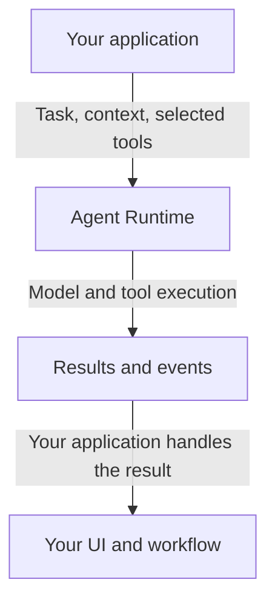

# Agent Runtime

**Run agents. Keep your application in charge.**

Agent Runtime is a service for adding agent execution to your product. Start
runs, connect tools, and receive execution events through an API. Your application
supplies the context and owns the user experience, permissions, and business rules.

[Get started](docs/quickstart.md) ·
[Python SDK](https://github.com/helpin-ai/agent-runtime-python) ·
[Go SDK](https://github.com/helpin-ai/agent-runtime-go) ·
[Integration boundaries](#what-belongs-where)

## Why Agent Runtime?

Adding an agent should not mean rebuilding your product around it.

You already have users, records, permissions, and workflows. Give the agent a
defined task, the relevant context, and the tools it is permitted to use. Handle
the result through your existing product.

**Your application owns the workflow. The runtime handles the agent run.**

## Get started

### 1. Start the service

Follow the [local quickstart](docs/quickstart.md) to start the runtime and a small
host application that supplies a sample article. It covers prerequisites,
credentials, agent registration, and the expected result.

The example uses a local source build, an in-memory store, and one process for
execution. You need repository access and a model provider account. For persistent
storage and separate workers, see [runtime configuration](docs/runtime-configuration.md)
and [deployment](docs/deployment.md). Use the source and documentation from the
same release; [CI and releases](docs/ci-cd.md) explains how builds are published.

### 2. Install the Python client

In a Python 3.10+ virtual environment:

```sh
python -m pip install "agent-runtime @ git+https://github.com/helpin-ai/agent-runtime-python.git@v0.5.0"
```

Use this repository-qualified installation to select Helpin’s SDK. Installing
the client does not install the runtime service. Pin the client and service
versions you test together.

### 3. Start a run from your backend

After completing the quickstart, this client registers an article-review agent
and starts a run against the sample article:

```python
import os

from agent_runtime import AgentRuntimeClient

with AgentRuntimeClient(
    base_url="http://127.0.0.1:8090",
    app_id="readme_demo",
    service_token=os.environ["AGENT_RUNTIME_SERVICE_TOKEN"],
) as client:
    agent = client.upsert_agent({
        "id": "article_reviewer",
        "name": "Article reviewer",
        "runtime_kind": "native_sdk",
        "system_prompt": "Review the supplied article and propose clear edits.",
        "allowed_targets": ["article"],
        "allowed_tools": ["get_context"],
    })
    run = client.start_run({
        "agent_id": agent.id,
        "target": {"type": "article", "id": "export-guide"},
        "instructions": "Review this article. Propose edits; do not publish.",
    })
    print("Run started:", run.id)

    for event in client.iter_run_events(run.id):
        print(event.sequence_no, event.type)
        if event.type in {"run.completed", "run.failed", "run.cancelled", "run.paused"}:
            break

    print("Run status:", client.get_run(run.id).status)
```

Keep service credentials in your backend. This agent can read context and has no
publishing tool. An instruction to avoid publishing is not an access control.
The [complete example](examples/article-review/review.py) also prints the proposed
edits and exits with an error if the run does not complete.

## What the interface covers

| Area | What you can build with it |
| --- | --- |
| **Runs** | Start work and inspect status, messages, artifacts, and execution details. |
| **Context** | Resolve application-owned records through a host context endpoint. |
| **Tools** | Supply selected MCP tools or configure workspace tools for repository work. |
| **Events** | Read live Server-Sent Events and retrieve recorded event history. |
| **Interactions** | Collect input or approvals and resume a paused run. |
| **Host integration** | Connect through Python or Go, and embed run UI with the React package. |

Use the [interface guide](docs/interfaces.md) and [HTTP API reference](docs/openapi.yaml)
for the contracts. The [React package](packages/react/README.md) provides transcript,
artifact, and interaction components; the [operator console](packages/console/README.md)
is a separate application.

## What belongs where?

| Agent Runtime | Your application |
| --- | --- |
| Execute an agent run | Own users, workspaces, records, and business rules |
| Request target context | Select the records the caller is authorized to access |
| Execute configured tools | Choose exposed tools and enforce backend authorization |
| Produce run results and events | Update the UI, records, notifications, and billing |
| Pause and resume interactions | Decide who may respond and what the response permits |

Your application registers its agents; deployment does not create them for you.
Keep product lifecycle policy in the host application. See
[agent ownership](docs/agent-ownership.md) and
[host configuration](docs/app-configuration.md) for the boundary in detail.



*An integration flow, not a deployment or network-isolation diagram.*

## Start with one bounded workflow

Article review is a useful first integration. Your application identifies the
article and supplies its content. The agent returns proposed edits. Your existing
product decides who can review and publish them.

Keep publication outside that first run. You can evaluate the proposal without
granting access to change the published article.

The same pattern works for an internal investigation or task review. The context,
tools, and permissions you configure determine what the agent can do; these are
integration examples, not built-in product workflows.

## Connect more of your application

- [Run-scoped MCP](docs/run-scoped-mcp.md): attach selected tools and short-lived
  credentials. Your application owns installation, OAuth, and refresh-token storage.
- [Repository workspaces](docs/repository-workspaces.md): connect authorized
  checkouts for coding work and handle their delivery lifecycle.
- [Runtime configuration](docs/runtime-configuration.md): choose storage,
  providers, and workers. Coding work needs the appropriate worker image and setup.
- [Local CLI](docs/cli.md): run coding and review agents from a checkout.

Recorded events do not by themselves guarantee exactly-once side effects, crash
recovery, or sandbox isolation. Review the contracts and operating requirements
for the execution mode you deploy.

## Relationship to Helpin

[Helpin](https://github.com/helpin-ai/helpin) gives teams a connected workspace for
support, projects, CRM, meetings, docs, and AI agents. Agent Runtime provides the
execution layer and can also serve other applications through the same host
interfaces.

Start with Helpin to try the complete product. Start here to integrate agent runs
into your own application.

## SDKs and compatibility

| SDK | Repository |
| --- | --- |
| **Python** | [helpin-ai/agent-runtime-python](https://github.com/helpin-ai/agent-runtime-python) |
| **Go** | [helpin-ai/agent-runtime-go](https://github.com/helpin-ai/agent-runtime-go) |

The quickstart uses Python SDK **v0.5.0**. This runtime checkout pins its Go SDK
in [go.mod](go.mod). Check the chosen SDK’s documentation for event protocol and
host contract support; do not assume every client version fits every runtime.

## Contributing

Start with a focused issue, a reproducible integration problem, or a documentation
improvement. For API changes, explain the impact on existing clients and include
compatibility tests. Read the [contributor guide](CONTRIBUTING.md) for setup and checks.

## Security

Do not post service tokens, model credentials, private prompts, or customer
records in public reports. Follow the [security policy](SECURITY.md) to use this
repository’s private GitHub reporting option when enabled.

## License

Agent Runtime, its React package, and its console are **Apache-2.0**. Third-party
material retains its own licenses and notices.

[Read the license](LICENSE) · [Attribution](NOTICE)
