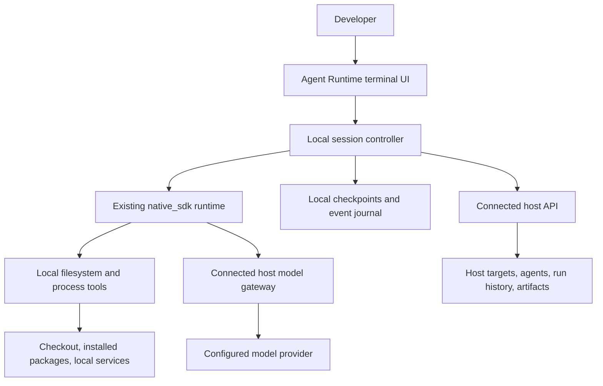

> Implementation update: an initial working CLI is implemented on
> `feat/host-neutral-local-cli`. See [usage and current limits](cli.md) and the
> [implemented alpha host protocol](cli-host-protocol.md). This remains the broader
> roadmap; it is not a claim that every release gate or Helpin integration below
> is complete.

# Agent Runtime local CLI implementation plan

Date: 2026-09-15  
Status: Proposed implementation plan; no CLI implementation has started.  
Scope: Original, host-neutral terminal application backed by Agent Runtime; Helpin is the first production host.

## 1. Decision and intended outcome

Build our own Agent Runtime CLI in Go with Bubble Tea, Bubbles, and Lip Gloss. Use other coding CLIs as references for observable interaction ideas. Do not fork Crush, copy its application code, or adapt its internal application interfaces. Its adoption and commercial licensing are outside this plan.

The CLI lets a developer sign in to any compatible host application, select an existing agent, and execute a host-linked run in a local repository using installed packages, toolchains, and development services. The developer can inspect progress, respond to questions, control execution, review changes, run tests, and resume work from the terminal. The connected host shows the associated run, transcript, findings, and selected artifacts according to its capabilities.

Keep `native_sdk` as the execution harness. The CLI is an additional execution location and user interface for the existing agent system. System agents and custom agents continue to share the same execution path and policy model.

The core must not require a Helpin account, Helpin identifiers, or Helpin billing. Any host can implement the versioned CLI host protocol and supply its own OAuth server, agent catalog, scope model, model access, tools, and result storage. Merely using Agent Runtime internally does not make an application CLI-compatible: its trusted-worker integration must be complemented by the user-authorized host protocol.

### Naming and command compatibility

Use **Agent Runtime CLI** as the product name and **`agent-runtime-cli`** as the initial executable. The existing `agent-runtime` executable starts the server; do not silently replace its behavior or break deployments. A later unified `agent-runtime` command with an explicit `serve` subcommand requires a separate compatibility migration. Do not choose `ar` as a shortcut; it conflicts with the existing archive utility.

Helpin is a connection/profile name and the first production host, not the CLI brand. A host may eventually offer a thin branded launcher, but all such launchers must use the same implementation. A `helpin` binary is not needed for the first version.

### Primary success scenario (Helpin pilot)

1. Install one binary and sign in through the browser.
2. Link an existing checkout to a Helpin workspace and repository.
3. Select a coding agent and an existing task.
4. Watch the agent inspect the checkout, make a change, and execute the project's tests.
5. Inspect the diff and validation evidence in the terminal.
6. Find the same run and results on the Helpin task.
7. Interrupt and resume without losing the conversation or blindly repeating completed mutations.

The product must explain that execution happens locally while selected repository content, prompts, and tool output can be sent to the model and synchronized to the selected host. This is not an offline-model or local-only-data promise.

## 2. Scope and defaults

### First public beta

- Native installation on macOS arm64/amd64 and Linux arm64/amd64; Linux binaries usable under WSL after validation.
- Multiple named host connections, browser OAuth login/logout, account inspection, and host-provided scope selection.
- Existing system and custom agents, limited to capabilities supported by the local runner.
- Interactive conversation, a multiline editor, streaming text and command output, questions, permissions, cancellation, and resume.
- Current-checkout execution by default; an optional separate Git worktree.
- Coding, review, and explicit review-with-tests workflows.
- Host-managed model access through an authenticated gateway; Helpin is the first production implementation.
- Local durable checkpoints plus authenticated synchronization to the connected host's run records.
- Plain output and versioned JSON events for scripts and CI consumers.
- Native archives first; an optional npm launcher after native installation is proven.
- A published host protocol and conformance fixtures, validated against Helpin and a minimal independent host before beta.

### Deliberately later

- Native Windows execution until its process and filesystem compatibility gates pass.
- A background machine agent or browser-initiated execution on a developer's laptop.
- Moving an active local run to another machine or a cloud worker.
- Unrestricted offline model execution, local BYOK providers, and subscription-provider login flows.
- Multiple coding runs writing the same checkout concurrently.
- Plugin marketplaces, a public UI-extension API, and an independent CLI agent engine.
- A full LSP client stack, embedded browser, image rendering in terminals, and a general-purpose terminal emulator.
- Automatic commits, pushes, PR publication, and unattended environment setup.

These exclusions concern this launch. They do not remove corresponding capabilities from existing server deployments. Unsupported capabilities must be visible before a local run starts.

## 3. Verified starting point

The following findings come from source inspection and targeted probes during the architecture review, not from a completed CLI prototype.

| Area | Current evidence | Implication |
| --- | --- | --- |
| Execution | The runtime contains a lightweight executor, `native_sdk`, filesystem/search/edit/Git tools, interactions, and checkpoints. | Reuse the engine and tool contracts. |
| Admission | `internal/engine/execution_policy.go` requires coding capability even for lightweight execution. | Configure a trusted local execution capability explicitly; preserve server admission checks. |
| Model streaming | `internal/runtime/native_exec.go` emits assistant and tool-argument deltas. | Adapt existing events; do not parse a rendered transcript to reconstruct state. |
| Command output | `run_command` collects output until completion; `commandOutput` retains a 50,000-byte tail. | Add an output stream and separately bounded stored logs. |
| Command lifecycle | Commands are synchronous and limited to 1–900 seconds. | Introduce managed process sessions for long tests and development servers. |
| Native Windows | A Windows cross-build of `internal/tools` failed on `Setpgid` and `syscall.Kill` in command and Git execution. | Introduce platform implementations; do not promise Windows from the UI framework's support alone. |
| Local SQLite | A probe of the pinned SQLite driver with `CGO_ENABLED=0` returned its unsupported-driver error. | Choose and verify local persistence before packaging the CLI. |
| Environment | `procenv.Command()` strips most variables and ignores the deployment allowlist escape hatch. | Add a local environment policy without widening server-worker inheritance. |
| Packaging | `Dockerfile` pins Go 1.24.3; Bubble Tea v2.0.9 declares Go 1.25. | Resolve a compatible, pinned build toolchain and transitive dependencies. |
| Embedding | Engine implementation packages are under `internal/`. | Put the first CLI entry point in this repository; avoid a premature public embedding SDK. |
| Helpin integration | Generic launches, MCP OAuth, runtime event projection, and usage settlement already exist. | Reuse business rules through new user-authorized local-run entry points. |

Relevant local references:

- [Runtime interfaces](interfaces.md)
- [Agent ownership](agent-ownership.md)
- [Repository workspaces](repository-workspaces.md)
- [Native cutover](native-cutover.md)
- [Existing native-runtime plan](2026-09-12-minimal-runtime-plan.md)
- [Command execution](../internal/tools/workspace_command_tools.go)
- [Output buffering](../internal/tools/command_output.go)
- [Environment policy](../internal/procenv/procenv.go)
- [Runtime admission](../internal/engine/execution_policy.go)

The older minimal-runtime plan intentionally deferred process sessions for the support launch. This CLI project creates a new, separate reason to implement them. It must not expand the support image or enable coding on default support workers. Some older Helpin architecture documents still mention retired executors; active `native_sdk` admission is the authority for this work.

## 4. Architecture and ownership



### Responsibilities

| Component | Owns |
| --- | --- |
| Terminal UI | Rendering, editor state, navigation, local interaction input, terminal restoration. |
| Session controller | Run lifecycle, event subscription, checkpoint recovery, synchronization, presentation snapshots. |
| Agent Runtime | Model loop, tools, context/skills, interactions, durable execution state, effective runtime policy. |
| Local process manager | Child processes, output, cancellation, environment construction, development-server lifecycle. |
| Connected host | Identity, membership, agent versions, target authorization, host mutations, run admission, entitlements, shared artifacts. |
| Model gateway | Provider credentials, model authorization, request limits, provider-authoritative usage accounting. |

### Host discovery and interoperability contract

`connect HOST-URL --name NAME` discovers a host descriptor, validates compatibility, registers a named local connection, and starts OAuth when needed. The descriptor endpoint is a proposed project convention, for example `/agent-runtime/cli.json`; allow an explicit descriptor URL for applications mounted below a path. This is not an existing Internet standard or an endpoint already implemented by current runtime hosts.

The descriptor identifies:

| Field group | Purpose |
| --- | --- |
| Protocol version, supported versions, API base URL | Negotiate a documented host API without compiling product-specific routes into the CLI. |
| Application ID, display name, protected resource identity | Identify what the user is connecting to; a display name is not an authorization credential. |
| Authorization server metadata, public client registration/configuration | Discover the browser and token endpoints and the client registration accepted by this host. |
| Scope/context selection | Advertise an opaque authorized scope and human-readable label; a host may call it workspace, team, project, or omit selection entirely. |
| Capabilities | Advertise supported targets, agent roles, local execution, interactions, model gateway modes, artifacts, and run controls. |

Use OAuth authorization-server metadata (RFC 8414) and protected-resource metadata (RFC 9728) where supported instead of inventing replacements for their fields. OAuth discovery does not register a client automatically: each host must provision an accepted public CLI client or support an explicitly specified registration mechanism. Do not assume a universal client ID works at every issuer.

The versioned host protocol defines common request/response shapes for identity and scope selection, executable agent discovery, target resolution, local admission, grants, controls/interactions, event synchronization, model access, and artifacts. Optional capabilities have explicit unsupported behavior. A host may provide unmetered model access and no shared artifact capability; Helpin's commercial billing rules are not mandatory core fields. Required execution capabilities still fail admission when absent.

The CLI treats target references as `{type, id}` with optional display metadata. It does not contain task/CRM/support-specific branches. Model/tool schemas and allowed operations come from the admitted agent and verified host configuration. A host descriptor is data; it cannot install arbitrary code, auto-run setup commands, or widen local permissions.

### Product-specific behavior inside a generic session

A Helpin session will contain tasks, task instructions, comments, and status updates. Those concepts enter through the host contract and agent tools; they do not require task business logic in the terminal application.

| User action | Generic CLI responsibility | Helpin responsibility |
| --- | --- | --- |
| Select task TASK-123 | Send a target search/reference and display returned labels and links. | Resolve the task, verify access, and supply its context. |
| Ask the agent to implement it | Start the selected agent and render progress. | Supply the agent snapshot, skills, authorized task tools, and model policy. |
| Read or update the task | Render a tool invocation, any interaction, and its result. | Execute the tool through Helpin services with current actor/object permissions. |
| Attach test evidence | Upload through the advertised artifact contract and display its reference. | Persist the artifact and associate it with the authorized task/run. |
| Mark work complete | Submit the permitted host operation and show the result. | Enforce task lifecycle and completion rules. |

The model may see Helpin-specific tool names and schemas. The CLI treats them as data, with generic summaries and structured-result/artifact viewers. Filesystem edits, shell output, and diffs use shared runtime renderers because those are common execution capabilities. Unknown host tools still render usefully without adding a renderer or rebuilding the CLI.

For example, `--target task:TASK-123` is passed to Helpin's resolver; a different host can accept `--target change_request:42` through the same code. Target search returns opaque references, labels, descriptions, and optional links. It does not require a generic implementation of every product's forms, statuses, or screens.

Do not add `tasks create`, task-board screens, CRM navigation, or Helpin-specific workflow editors to the core CLI. Those would be separate product CLI features if requested later. The first CLI surface is agent execution, local verification, interactions, and results. Tests must demonstrate that a Helpin tool and an unfamiliar fixture-host tool both work without a product-name branch in the renderer or session controller.

Keep credentials, grants, agent caches, histories, drafts, and synchronization cursors isolated by connection/resource, account, and host scope. Include host identity in local run lookup; identical run IDs from different hosts must not collide. Connection switching cannot silently rebind an existing run or upload one host's transcript to another. Bind OAuth state to the initiating connection/issuer and route tokens only to their intended resource; do not forward bearer tokens across arbitrary redirects or advertised origins.

Require HTTPS outside explicitly configured local development. Permit separate authorization-server domains through the validated metadata flow, not by reusing credentials from a previously connected host. Make the selected host identity visible during login and before the first run.

In the rest of this document, workspace authorization and Helpin service paths describe the first host implementation. The common protocol uses an opaque host scope and supports apps without Helpin's tenant or task model. The runtime's filesystem workspace remains a different concept.

### Runtime independence

- Terminal dependencies stay in CLI packages. The server engine must not import Bubble Tea or UI models.
- The CLI uses a versioned host protocol. Product-specific identity, target handling, and business rules stay in the host implementation; Helpin implements this protocol through its services.
- A narrow session interface exposes start, submit, interrupt, cancel, resume, snapshot, and event subscription operations. Exact signatures are finalized in phase 1.
- Use existing SDK event/data types where they accurately represent the operation. Add versioned neutral types where required; do not expose engine implementation structs as a new public API.
- Start with an in-process runner and one binary. The boundary must allow a future subprocess implementation without changing UI behavior.
- The UI never calls model providers, executes tools, or writes engine checkpoints directly.
- Loggers and child processes never write directly into the interactive renderer's terminal stream.

### Proposed repository layout

```text
agent-runtime/
  cmd/agent-runtime-cli/              User-facing CLI; existing server command is preserved
  internal/cli/
    commands/                        login, init, run, review, sessions, doctor
    config/                          user/project configuration
    auth/                            browser flow and OS credential storage
    host/                            discovery, generic host client, gateway adapters
    session/                         lifecycle, snapshots, UI-facing events
    sync/                            journal upload, acknowledgments, recovery
    tui/                             original Bubble Tea implementation
    output/                          plain and JSON renderers
  internal/hostprotocol/             neutral host contract and conformance fixtures
  internal/localexec/                local runner composition and capability policy
  internal/process/                  reusable process lifecycle primitives
  internal/store/                    persistence extension/reuse as selected
  internal/tools/                    existing tools and process-tool adapters
  packages/cli-launcher/              optional npm distribution wrapper
  docs/cli-host-protocol.md           proposed protocol and host implementation guide
  internal/hostprotocol/testhost/     independent host fixture with non-Helpin targets

helpin/
  server/internal/handler/           CLI auth, local admission, sync endpoints
  server/internal/service/           authorization, projection, gateway, settlement
  server/internal/model/             grants and local-execution metadata
  server/internal/repository/        corresponding persistence
  server/internal/router/            route wiring
  server/internal/agentcontract/     capability/catalog changes
  frontend/src/                     OAuth consent and local-run presentation
```

These paths are proposed ownership locations, not existing implementations. Use existing abstractions instead of introducing every directory if a smaller structure fits.

## 5. Terminal experience

### Main conversation

Use normal terminal scrollback for the main conversation. Keep the active response, current command, and multiline composer in the live region. Commit completed transcript entries as stable output.

This means old entries are not arbitrary editable widgets. A command's compact result links to a details view; expanding an old command opens that view rather than rewriting distant scrollback. Use a temporary full-screen viewer for logs, diffs, searchable history, and review findings, restoring the conversation on exit.

Prototype this behavior before building the entire UI. If terminal tests show unacceptable selection, resize, or rendering behavior, record a product decision to use application-managed scrolling instead. Do not silently change that interaction model halfway through implementation.

### Main components

- Header: host connection, selected host scope, agent, repository/branch, target label, and connection state.
- Transcript: user/assistant messages, tool start/result summaries, questions, and permission decisions.
- Composer: multiline text, paste handling, history with draft preservation, file references, and slash-command completion.
- Activity: current command, elapsed time, a bounded live output tail, and a clear action to view logs.
- Status: execution state, synchronization state, usage when available, and actionable errors.
- Details viewers: selectable/copyable command output, file diffs, review findings, and session history.

### Input and accessibility

- Choose unambiguous interrupt and exit bindings and display them in help.
- Support an alternative newline binding where terminals cannot distinguish Shift+Enter.
- Handle bracketed paste, long pasted input, Unicode graphemes, wide characters, narrow terminals, and resize.
- Preserve an unsent draft across history navigation and recoverable UI failures.
- Respect `NO_COLOR`; provide text labels alongside status colors.
- Provide plain output for non-TTY environments and users who prefer linear output.
- Sanitize control sequences from model and command content before transcript rendering; terminal-control bytes must not become executable display instructions accidentally.

### Proposed commands

```bash
agent-runtime-cli connect https://helpin.ai --name helpin
agent-runtime-cli connect https://work.example.com --name work
agent-runtime-cli connections list
agent-runtime-cli connections use helpin
agent-runtime-cli login
agent-runtime-cli whoami
agent-runtime-cli logout
agent-runtime-cli init
agent-runtime-cli doctor
agent-runtime-cli agents list
agent-runtime-cli
agent-runtime-cli run --agent AGENT-ID --target task:TASK-123
agent-runtime-cli run --agent AGENT-ID --target task:TASK-123 --worktree
agent-runtime-cli review --base main
agent-runtime-cli review --base main --run-tests
agent-runtime-cli runs list
agent-runtime-cli runs resume RUN-ID
agent-runtime-cli runs show RUN-ID
agent-runtime-cli runs logs RUN-ID
agent-runtime-cli runs diff RUN-ID
agent-runtime-cli runs sync RUN-ID
agent-runtime-cli run --agent AGENT-ID --target task:TASK-123 --json
```

These are proposed interfaces. `review` resolves a host-advertised review agent; it does not embed a separate reviewer prompt or bypass agent versioning. Agent IDs and target references resolve within the selected connection and host scope. `task:TASK-123` is a Helpin example; target types are opaque host data, not a CLI enum. Resume requires the necessary local workspace/checkpoint; a cloud history record alone is insufficient.

Interactive mode is selected by terminal detection with an explicit override. JSON output uses a versioned envelope, emits data only on stdout, and sends diagnostics to stderr. Document distinct exit codes for success, execution failure, required interaction, interruption/cancellation, and invalid configuration/authentication. A review finding is a successful review result; a separate option can request CI failure at a configured finding severity.

## 6. Configuration, repository identity, and environment

### Configuration ownership

- User configuration stores named connections, instance/resource/issuer identity, preferences, and the selected host scope under the OS-appropriate `agent-runtime` config directory.
- `connect` adds/authenticates a profile; `connections use` selects a default for new work. An explicit `--connection NAME` overrides that default. Already-created runs retain their original connection, account, and scope.
- OAuth credentials live in the OS credential store. If it is unavailable, provide an explicit alternative credential backend with restrictive file permissions and clear behavior; do not silently downgrade storage.
- Optional `.agent-runtime/project.json` stores non-secret connection/scope/repository identifiers and local workflow preferences. Show its exact content before writing during `init`.
- Checkpoints, logs, and drafts live outside the repository under an OS-appropriate application-data directory.
- Never store tokens in project configuration or sync the contents of `.env` files as setup metadata.
- Repository configuration may narrow permissions but cannot expand a user's local execution grant or host authorization.
- Do not automatically execute repository-provided setup commands during startup or `init`.

### Repository identification

Resolve the real checkout path and inspect Git metadata without changing branches. Record repository identity, base/head SHA, dirty state, and relevant diff fingerprints. Support a user selecting among multiple matching repositories advertised by the host. Do not treat a Git remote URL as proof of host access.

Default to the existing checkout to preserve installed dependencies and uncommitted work. Acquire a local execution lock before writing. Preserve existing modifications and distinguish them from changes observed during the run. Do not automatically stash, reset, clean, or remove user work.

Optional worktrees must state that dependencies, ignored files, local configuration, and services may need separate preparation. Do not share `node_modules` through automatic symlinks. Record worktree ownership and require a safe cleanup decision when changes remain. A worktree provides checkout separation, not an OS security sandbox.

### Environment profiles

Create an explicit local environment builder. Keep server `procenv.Command()` behavior unchanged unless a narrowly scoped refactor is required.

The local profile should support PATH, locale, CA/proxy settings, temporary/cache directories, virtual environments, and configured project variables. Never pass the CLI's host OAuth refresh tokens or internal runtime credentials to agent-controlled child processes. Model provider secrets remain at the gateway in the managed mode.

`doctor` checks executable discovery and required configuration without printing secret values. It distinguishes missing dependencies, unavailable local services, unsupported tools, and incompatible CLI/runtime versions. A developer invoking the CLI from an activated environment should have a documented way to preserve that environment's intended toolchain behavior.

## 7. Local execution and process management

### Execution capability

Compose the lightweight native engine with explicit local coding capability. The selection comes from the trusted CLI composition and the admitted run policy, not a model-supplied profile string. Preserve the prohibition on coding in ordinary support workers.

Intersect saved-agent tools, the admitted run's tools, supported local capabilities, and the user's local execution policy. Report unsupported required tools before model execution. Optional unavailable tools are omitted with a visible explanation. Custom agents use the same mechanism.

### Process manager

Implement these capabilities below the terminal layer:

1. Start a program with explicit arguments, working directory, environment, and operation identity.
2. Emit stdout/stderr chunks with process ID, stream identity, ordering, and timestamps.
3. Retain a bounded live tail and a separately size-limited log on disk; make truncation visible.
4. Return structured exit status, duration, timeout/cancellation reason, and log reference.
5. Support a finite command and an explicitly managed long-running process, such as a development server.
6. Allow polling/output retrieval and stopping only processes owned by the run.
7. Propagate cancellation to the child process tree; allow a short graceful interval before forced termination.
8. Clean up owned development servers on cancellation/exit and record uncertain cleanup after crashes.

Preserve existing `run_command` callers. Prefer additive process-session tools for background jobs, with canonical schemas and host catalog updates. A process handle must not authorize access to another run's process. Do not kill a PID recorded in an old journal without verifying process identity and ownership.

Use pipes for noninteractive builds/tests initially. Support terminal handoff to an external editor as an explicit UI operation. A general PTY/ConPTY subsystem is a later capability unless phase 1 demonstrates a required workflow that cannot run through pipes. UI framework process helpers do not replace the runtime process manager.

Use platform-specific files for process-group and signal operations. Native Windows requires appropriate process-tree management and validation of paths, executable discovery, environment names, and cancellation. Cross-compilation alone is insufficient for release.

### Review semantics

- Default review permits repository inspection and produces findings with path, line, severity, rationale, and the reviewed SHA/diff fingerprint.
- `--run-tests` explicitly authorizes executing project code and writing normal test/build artifacts under the local execution policy.
- The reviewer does not receive agent-directed source-edit tools by default. However, test code itself can modify files; this mode must not be described as a filesystem-enforced read-only sandbox.
- Capture before/after repository state and report unexpected changes. Never automatically discard them.
- Report which commands ran, their results, and which checks were unavailable. Findings must distinguish observed defects from hypotheses.
- Treat executing an untrusted checkout as a separate environment decision. The initial trusted-local mode must not claim stronger isolation than it implements.

## 8. Local state, events, and recovery

### Persistence decision

In phase 1, compare a compatible pure-Go SQLite integration against deliberate CGO-enabled distribution. Prefer a store that reuses the runtime's checkpoint semantics while building reliably on the supported platforms. Do not choose an in-memory store for resumable production runs.

Validate transactional checkpoint/journal writes, schema migrations, concurrent process locking, disk-full behavior, recovery after interruption, and backup/export. Keep CLI-only schema changes isolated from server Postgres behavior where possible.

### Event contract

Use a versioned neutral envelope with `event_id`, `run_id`, `execution_id`, `execution_epoch`, `sequence_no`, `type`, `timestamp`, and typed data. Reuse existing event types and SDK fields where possible; define additions through the normal runtime/host contract process.

Required categories include run transitions, message deltas/finalization, tool start/completion, process output/status, interactions, artifact references, usage updates, and synchronization status.

- Durable run state and a replay cursor are the recovery authority.
- UI paint updates may be coalesced. Tool outcomes, interaction decisions, and lifecycle transitions must not be discarded as render optimization.
- Avoid one database transaction or one UI redraw per token. Batch deltas with explicit flush rules.
- Apply backpressure outside the UI update loop; a slow renderer or host connection must not create unbounded memory growth.
- For heavy process output, preserve bounded logs and references rather than forcing every byte through the shared transcript.
- Define reconnect as snapshot plus replay from an acknowledged cursor. Detect gaps; do not silently assume a live subscription delivered every event.

### Lifecycle mapping

| Situation | Local behavior | Host presentation |
| --- | --- | --- |
| Authorized start | Persist run/checkpoint before execution. | Normal run, marked as local execution. |
| Awaiting input/approval | Persist the interaction; stop dependent work. | Existing paused state plus interaction reason. |
| User interrupt | Stop current work safely and preserve a resumable checkpoint where possible. | Paused/interrupted reason, distinct from terminal cancellation. |
| User cancel | Stop owned processes and mark the run cancelled. | Cancelled after acknowledgment; pending command delivery remains visible. |
| Network unavailable | Preserve output, finish an already-started local operation if policy allows, pause before new model/host-dependent work. | Last-seen and synchronization status; no claim that the machine stopped immediately. |
| Process/UI crash | Recover journal/checkpoint; inspect ambiguous tool outcomes. | Disconnected or recovery-needed presentation. |
| Repository changed before resume | Compare identity and fingerprints; require reconciliation where relevant. | Resume blocked with a reason, history retained. |
| Completion | Persist results, close owned processes, flush sync. | Completed with sync status and result provenance. |

Reuse existing run statuses (`queued`, `running`, `paused`, `completed`, `failed`, `cancelled`). Connection state and pause reason should be metadata/presentation fields unless an audited state-model change is necessary.

Do not promise exactly-once arbitrary shell execution. Record intent and outcome boundaries. If a mutation may have completed before the result was checkpointed, require reconciliation rather than replaying it blindly. Resume validates the original agent/model snapshot, local repository, permissions, and current server grant.

Closing the foreground CLI does not leave an undocumented background worker. It performs a bounded shutdown and checkpoint. Background execution is a later product capability.

## 9. Host identity and local-run admission

### OAuth

Implement browser authorization code flow with PKCE S256, state verification, and a loopback callback. Register the CLI as a public client without an embedded client secret. Bind the callback to loopback and validate redirects according to native-app guidance.

Inspect the existing MCP OAuth implementation for reusable primitives, token rotation, and revocation. Do not assume MCP scopes or token audiences authorize the CLI's run API. Define a CLI audience and least-privilege scopes for agent discovery, run start/read/control, and artifact access. Workspace membership and object permissions remain server-checked on every protected operation.

This inspection/reuse happens in the Helpin host implementation. The CLI's OAuth client is generic and reads the selected host's supported scopes, resource, issuer, and client configuration; it does not call Helpin's MCP routes directly.

Provide short-lived access tokens, refresh rotation/reuse handling, logout/revocation, and separate credentials for different host resources, authorization issuers, accounts, and scopes. Do not copy browser session tokens. Device authorization for browserless SSH hosts is a later addition unless it becomes a beta requirement; PKCE callback behavior over SSH must be documented.

### Trust boundary

A developer-controlled binary is not a trusted server worker. Never distribute `AGENT_RUNTIME_SERVICE_TOKEN`, host callback secrets, provider API keys, or broad app credentials with a local run.

Local events are authenticated reports from that user and execution. They are not proof that code ran unmodified or tests passed honestly. Mark local result provenance and keep authoritative billing and host mutation decisions on the server. The client can enforce local policy for normal usage, but server authorization must remain effective if the client is modified.

### Admission transaction

1. Authenticate the user; resolve workspace, agent version, target, model access, and entitlements.
2. Intersect supported local capabilities with the effective agent policy and validate required capabilities.
3. Run the existing usage/billing preflight.
4. Create the host's normal run record with an explicit local execution location; in Helpin this is the existing `agent_run`.
5. Issue an execution identity, short-lived scoped grant, policy snapshot/hash, and expiration.
6. Return the executable agent snapshot, approved model configuration, context/skill references, and supported host operations.
7. The local runtime creates its execution state and binds its runtime ID to the server-issued execution identity idempotently.

Local admission must not also enqueue a cloud worker. Refactor shared preparation/authorization out of existing launch paths as needed; do not copy those business rules into a second launcher. Location is independent of `runtime_kind`; both locations use `native_sdk`.

Bind grants to the user, workspace, host run, execution, and allowed operations. An execution epoch fences stale clients after recovery/takeover. A signed grant is not a replacement for revocation and current authorization checks at model/host endpoints.

## 10. Host API, model gateway, and synchronization

The table below describes the Helpin implementation of the generic host protocol. Its `/api/cli/v1` paths are examples, not hardcoded CLI routes. The client uses the discovered protocol base URL and versioned relative operations; another host can expose a different base path. Existing Helpin discovery/catalog APIs need host-side projection into the common response shapes. These routes are proposed, not already available public APIs.

| Operation | Proposed surface | Important behavior |
| --- | --- | --- |
| Discover identity/workspaces | Existing authorized APIs exposed to CLI scopes | Derive actor from credentials. |
| Discover executable agents | Existing automation catalog plus local capability projection | Report incompatibility before launch. |
| Admit local run | `POST /api/cli/v1/runs` | Idempotency key; shared launch policy; no cloud dispatch. |
| Bind/renew execution | Run-scoped bind and lease endpoints | Verify execution epoch and current permissions. |
| Upload events | `POST /api/cli/v1/runs/{id}/events` | Bounded batch; deduplicate; acknowledge contiguous cursor. |
| Read state/controls | Run snapshot and cursor-based controls endpoints | Deliver cancel/host-interaction decisions once logically, with replay. |
| Invoke host operation | Run-scoped tool endpoint | Tool allowlist plus current actor/object authorization. |
| Access model | Run-scoped gateway request | Approved provider/model; request ID; enforce budgets. |
| Upload artifact | Run-scoped upload/finalize endpoints | Private storage, bounded sizes, authorized retrieval. |
| Complete/reconcile | Run outcome endpoint | Validate state/epoch; separate local reports from billing authority. |

### Model gateway

Preserve the provider semantics required by the existing native model adapter: streaming, tool calls, reasoning/model controls, continuation identifiers, cancellation, and errors. Do not route every provider through a generic compatibility shim if that loses behavior.

For the first end-to-end slice, support one existing configured API-key provider path. Expand the supported provider matrix only after its contract tests pass. Unsupported connections must produce an admission error; they must not export credentials as a fallback.

Use gateway-issued request IDs and provider-observed usage for billing. Deduplicate settlement separately from transcript/event retries. A client-reported token count must never determine the bill. Limit concurrent requests and total authorized spend. Handle a disconnect after provider acceptance as an uncertain request outcome; do not automatically start a duplicate paid generation without reconciliation.

### Host tools and artifacts

Invoke host tools using scoped user/run authorization through business services. Do not make existing trusted-worker callback routes public. Validate the tool name, input schema, target ownership, actor permissions, and any required host-side approval.

An approval for a local shell operation and an approval for a host mutation have different authorities. A browser action cannot expand the local machine's execution permissions. A locally fabricated approval event cannot authorize an otherwise forbidden host operation.

Persist shared artifacts using the host's private artifact lifecycle. Keep log files local by default; synchronize bounded summaries and explicitly selected artifacts. Do not upload the whole checkout or entire environment. Scrub known credentials and avoid accidental secret-file inclusion, while documenting that redaction cannot guarantee arbitrary output is secret-free.

### Synchronization and finalization

- Use a local outbox with retry, stable event IDs, sequence validation, payload bounds, and exponential backoff.
- Server derives scope from the grant; it must not trust client-supplied workspace IDs or callback URLs.
- Keep local-to-host run mappings explicit and immutable after binding.
- Display queued synchronization, last acknowledgment, and errors separately from execution success.
- Audit existing projection and delivery finalizers. Local completion must not trigger a cloud-side commit, push, branch cleanup, or PR workflow designed for runtime-owned cloud clones.
- Reuse usage settlement interfaces with a distinct authoritative gateway ledger for local execution.
- Reconcile cancellation and late results without resurrecting a cancelled run or settling usage twice.

## 11. Phased delivery

Every phase has reviewable outputs and a completion gate. The plan authorizes no implementation or external publication by itself.

### Phase 0 — Contracts and repository setup

**Work**

- Confirm supported platforms, foreground lifecycle, transcript behavior, and managed-model scope using the defaults above.
- Inventory existing launch, resume, tool, interaction, artifact, and billing paths in both repositories.
- Define the original CLI package boundary and neutral session/event interfaces.
- Define the host descriptor and publish protocol conformance cases, including a host with different target/scope names and no Helpin dependency.
- Specify OAuth audience/scopes, execution grants, event replay, process tools, and gateway contracts.
- Pin compatible dependency/toolchain versions; review the licenses of libraries actually introduced. No Crush application source enters the project.
- Record an additive schema and staged rollout strategy for Helpin.

**Gate:** contracts have concrete schemas, authority boundaries, error behavior, and acceptance scenarios; no duplicate agent engine is proposed.

### Phase 1 — Terminal and runner feasibility slice

**Work**

- Build an original small Bubble Tea transcript/editor and log/diff viewer using synthetic events.
- Add a minimal local session controller around the current native runtime with fake-model support.
- Validate the local persistence decision and lightweight coding admission.
- Exercise one real local edit and test command using a fixture repository.
- Measure rendering, input latency, terminal restoration, and long-output behavior.
- Build supported native targets; reproduce and isolate native Windows work without claiming it is complete.

**Gate:** no framework fork is needed for the selected UX; a small runtime interface supports the flow; checkpoint storage works in release-style builds. If a fundamental renderer issue remains, compare an alternative using the same event fixture before expanding the UI.

### Phase 2 — Local runner foundation

**Work**

- Implement the process manager, streamed output, bounded logs, cancellation, and owned background processes.
- Add the local environment profile, repository locks, configuration, and `doctor`.
- Complete checkpoints, the event journal, interrupt/resume, ambiguous-outcome handling, and crash recovery.
- Implement optional worktrees with safe preservation/cleanup rules.
- Register additive tool contracts and update affected host catalogs and SDK types.

**Gate:** fixture coding/review/test runs work without host connectivity using deterministic model responses; process cleanup and recovery tests pass; existing server behavior remains covered.

### Phase 3 — Generic host connections and Helpin admission

**Work**

- Implement generic host discovery, named connections, OAuth, credential storage, and scope/repository linking.
- Implement the same published host protocol in Helpin and in an independent minimal fixture host.
- Add user-authorized local-run admission, grants, renewal, and revocation.
- Refactor shared preflight and agent-snapshot preparation from the existing generic launch path.
- Add execution location and provenance to the normal run model and UI projection.

**Gate:** an authorized user can obtain a local execution grant from both Helpin and the independent fixture host with the same CLI build; cross-scope, expired, revoked, and unsupported requests fail; no cloud execution starts for a local run. A fixture with no Helpin workspace/task model must work without product-specific CLI branches.

### Phase 4 — Connected execution and shared results

**Work**

- Implement one provider gateway path with authoritative usage accounting.
- Implement scoped host operations, artifact access, outbox upload, replay, control delivery, and reconciliation.
- Connect questions and approvals to existing run interactions with the appropriate local/host authority.
- Audit finalizers and cancellation behavior for the local execution location.
- Run the full task-to-local-change-to-tests-to-Helpin-result scenario in staging.

**Gate:** one real Helpin task completes locally with correct history, artifact access, and billing; retries and disconnects produce neither duplicate execution nor duplicate settlement.

Also run an equivalent deterministic workflow against the independent host with a different resource/issuer and target type. Switching connections, reconnecting, and overlapping run IDs must preserve credential and transcript isolation. This is the architecture test that prevents the first production host from becoming an implicit requirement.

### Phase 5 — Complete the coding and review experience

**Work**

- Finish editor history, file references, slash commands, details views, and session selection.
- Add review findings, reviewed-revision display, test evidence, and original-versus-run diff presentation.
- Complete custom-agent compatibility checks, plain/JSON output, and noninteractive interaction behavior.
- Add supported provider paths individually with parity tests.
- Complete accessibility, terminal compatibility, and long-session performance checks.

**Gate:** representative users can complete coding and review tasks without needing the browser except for login or chosen host navigation.

### Phase 6 — Packaging and controlled beta

**Work**

- Produce signed/checksummed native archives, platform install instructions, shell completion, and version diagnostics.
- Add macOS signing/notarization and other platform release requirements as appropriate.
- Publish native channels first; add an npm launcher that selects matching, pinned platform artifacts and correctly forwards signals/exit codes.
- Test clean install, upgrade, rollback, configuration retention, and checkpoint compatibility.
- Enable a limited workspace beta with server-side capability flags and rollback controls.
- Document known platform limits, managed-model requirements, trusted-local execution, and synchronization behavior.

**Gate:** the platform and integration matrix passes; there is a named release owner and a tested rollback path; no claim of support exceeds tested platforms/capabilities.

## 12. Suggested PR breakdown and dependencies

| PR | Repository | Deliverable | Depends on |
| --- | --- | --- | --- |
| 1 | Agent Runtime | Host/session/event contracts, original CLI skeleton, compatible toolchain decision | Phase 0 |
| 2 | Agent Runtime | TUI feasibility slice and synthetic event fixtures | 1 |
| 3 | Agent Runtime | Local runner composition and persistence | 1 |
| 4 | Agent Runtime + affected SDK/catalog surfaces | Process manager, streaming, additive process tools, local environment policy | 3 |
| 5 | Agent Runtime + Helpin | Generic connections/discovery/OAuth, fixture host, Helpin protocol implementation | Phase 0 |
| 6 | Helpin | Local admission, execution grants, schema, no-cloud-dispatch routing | 5 |
| 7 | Helpin + Agent Runtime adapter | Model gateway and usage reconciliation | 3, 6 |
| 8 | Both | Scoped host tools, event sync, controls, artifacts, finalizer changes | 4, 6 |
| 9 | Agent Runtime | Integrated coding flow, recovery, repository/worktree behavior | 2, 4, 7, 8 |
| 10 | Both | Review flow, local-run presentation, custom-agent compatibility, JSON mode | 9 |
| 11 | Agent Runtime | Packaging and terminal/platform validation | 10 |
| 12 | Helpin + release configuration | Controlled beta and rollback controls | 11 |

Split cross-repository entries into separately reviewable PRs with backward-compatible deployment ordering. Keep host schema/API additions disabled until compatible runtime/CLI versions exist. Runtime-local execution changes need their own server-regression checks; an end-to-end CLI test does not replace them.

## 13. Acceptance and validation matrix

### UI and performance

Use a replay fixture with at least 10,000 transcript entries, long Markdown/code blocks, and a command producing at least 10 MB of output. The entire log need not be rendered or uploaded.

- Set a provisional p95 input-to-paint target below 100 ms on a documented reference machine while streaming.
- Verify memory is bounded by configured caches/tails instead of all historical rendered output. Record actual measurements and a regression threshold after phase 1.
- Verify resize, scrollback, copying, full-screen viewer entry/exit, malformed ANSI, Unicode, large paste, Ctrl+C, and terminal restoration after errors.
- Exercise macOS Terminal/iTerm2, a Linux terminal, VS Code integrated terminals, and SSH/tmux. Test WSL separately.
- Use deterministic component/event tests plus real terminal sessions. Snapshot tests alone cannot establish terminal compatibility.

### Local execution

- A small patch passes tests; a multi-file change preserves unrelated edits.
- A seeded review defect yields a concrete finding against the correct revision.
- Review-with-tests reports actual execution and any source changes made by tests.
- A noisy or long-running process remains observable and cancellable.
- A child that spawns grandchildren is cleaned up on cancel.
- Missing dependencies, a full disk, interrupted writes, and a changed repository produce recoverable explanations.
- Crash after a possible mutation does not blindly replay it.
- Resuming from the wrong machine or without the original checkout is rejected clearly.

### Identity and server trust

- The same CLI build connects to Helpin and an independently implemented fixture host without endpoint/name special cases or recompilation.
- Missing/incompatible descriptors, unsupported capabilities, and unregistered OAuth clients fail with actionable errors; a normal runtime service URL is not mistaken for a compatible user-facing host.
- Identical app/run IDs on different origins and multiple accounts on one issuer do not collide. Switching profiles cannot leak tokens, histories, artifacts, or approvals.
- Wrong PKCE verifier/state, callback misuse, refresh-token reuse, expired/revoked grants, and cross-instance credentials are rejected.
- Cross-workspace agent/task/artifact requests and forged local run identities are rejected.
- A modified client cannot access disallowed host tools, broaden a model grant, fabricate billable usage, or use local approval reports to bypass host authorization.
- Local admission never creates a second cloud execution.
- No client receives internal service tokens or provider credentials in managed mode.

### Synchronization and billing

- Replayed, duplicate, out-of-order, oversized, and stale-epoch events have defined outcomes.
- Disconnect/reconnect preserves history and does not duplicate host mutations.
- Cancel racing with completion or tool output converges to a valid state.
- Provider disconnects and uncertain requests do not trigger uncontrolled duplicate generations.
- Usage settlement remains idempotent across event retries, completion retries, and recovery.
- Local completion cannot trigger cloud repository delivery finalizers.

### Distribution

- Test fresh installations without a preinstalled Go toolchain; native installs also work without Node.
- Verify the selected database in release-mode binaries on every supported platform.
- Verify upgrade and rollback against a previous-version checkpoint/configuration fixture.
- Verify npm platform selection, signal forwarding, exit codes, version matching, and absence of updates during active execution.
- Native Windows remains excluded until real Windows tests pass, even if cross-builds succeed.

## 14. Release, observability, and rollback

- Add server capability flags for local admission and each managed gateway/provider path.
- Expose minimum/maximum compatible contract versions through a capability endpoint. Reject incompatible clients before execution with an upgrade explanation.
- Restrict beta access by workspace while monitoring admission failures, gateway failures, synchronization lag, interrupted runs, duplicate events, and usage-reconciliation errors.
- Collect operational metadata with explicit product controls; do not silently collect repository contents, prompts, environment values, or full command logs as telemetry.
- Make local diagnostic bundles opt-in and redact known sensitive fields.
- Rollback can disable new local admissions while preserving history access and safe synchronization/recovery for existing runs. Emergency revocation must block new protected operations and show its effect clearly.
- Keep schema changes additive through the compatibility window. Preserve a last-known-good binary and document checkpoint migration compatibility.
- A disconnected machine cannot be assumed to honor a remote cancel immediately. UI and operational documentation must reflect this limitation.

## 15. Open decisions and proposed defaults

These are implementation decisions to resolve at the named phase; they do not block writing this plan.

| Decision | Proposed default | Resolve by |
| --- | --- | --- |
| Application base | Original host-neutral CLI; permissively licensed terminal libraries | Accepted user direction |
| Product/executable name | Agent Runtime CLI / `agent-runtime-cli`; preserve the existing server executable | Proposed naming decision |
| Host compatibility | Versioned discovery and host protocol; Helpin plus independent fixture host | Phase 0/3/4 |
| Main transcript | Native scrollback with dedicated details viewers | Phase 1 terminal gate |
| Engine location | In-process lightweight `native_sdk` | Phase 1 |
| Local database | Compatible pure-Go persistence if checkpoint and migration tests pass | Phase 1 |
| Public beta platforms | macOS/Linux plus verified WSL | Phase 0 |
| Native Windows | Separate port with real OS testing | Before advertising support |
| Default checkout | Existing checkout, preserving dirty files | Phase 0 |
| Model credentials | Host-managed gateway; Helpin and one provider in first production slice | Phase 0/4 |
| Browserless login | Defer device flow unless SSH beta needs it | Phase 0 |
| Resume after disconnect | Local checkpoint plus fresh grant and repository validation | Phase 2/4 |
| Host publishing | Explicit later action; no automatic push/PR | Phase 0 |
| npm distribution | Optional thin launcher after native packaging | Phase 6 |

The largest effort uncertainties are local process lifecycle, trusted-server versus local-client authorization, gateway/provider parity, and terminal behavior under load. Size those after phase 1 and the API contract review. A calendar estimate before those checks would be speculative.

## 16. Sources and implementation references

External references were reviewed on 2026-09-15. Pin exact dependency revisions during implementation rather than depending on moving branches.

- [Bubble Tea](https://github.com/charmbracelet/bubbletea): terminal framework and component model.
- [Bubble Tea v2.0.9 module requirements](https://github.com/charmbracelet/bubbletea/blob/v2.0.9/go.mod): build-toolchain compatibility reference.
- [Bubble Tea license](https://github.com/charmbracelet/bubbletea/blob/main/LICENSE): library license reference.
- [OAuth for native applications, RFC 8252](https://www.rfc-editor.org/info/rfc8252/): public-client browser authorization and loopback guidance.
- [OAuth security best current practice, RFC 9700](https://www.rfc-editor.org/info/rfc9700/): token and authorization security guidance.
- [Authorization server metadata, RFC 8414](https://www.rfc-editor.org/info/rfc8414/): discovery of issuer capabilities and OAuth endpoints.
- [Protected resource metadata, RFC 9728](https://www.rfc-editor.org/info/rfc9728/): resource identity and authorization-server discovery.

Crush and other coding CLIs may inform behavioral comparison sessions. Their application source is not an implementation dependency or a source of copied components in this plan.
